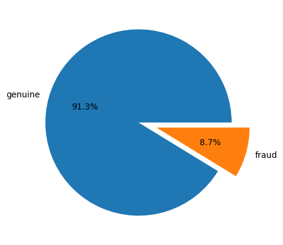

# Advanced FinTech Security via Federated Learning and Deep Anomaly Detection.
Innovative FinTech Security: Federated Learning and Anomaly Detection Technique using Deep Learning algorithms.

We used the Bitcoin preprocessed dataset for this project. The Kaggle link for the dataset is below:

https://www.kaggle.com/datasets/mohsinakram821/preprocessed-bitcoin-transaction-dataset

We utilized Autoencode which is a powerful deep-learning algorithm for anomaly detection purposes. This research project enhances the security of hybrid networks, especially financial systems.

## Results
The following graphs illustrate the performance of the Autoencoder algorithm on the Bitcoin transaction dataset:

.png)

.png)

.png)

.png)

.png)

.png)

.png)

.png)

.png)

.png)

.png)

These results demonstrate the effectiveness of the model in identifying anomalies in financial transaction data.

